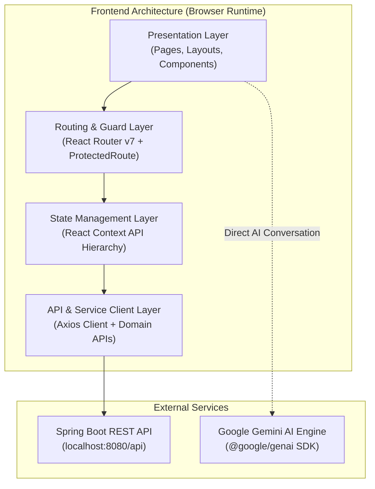
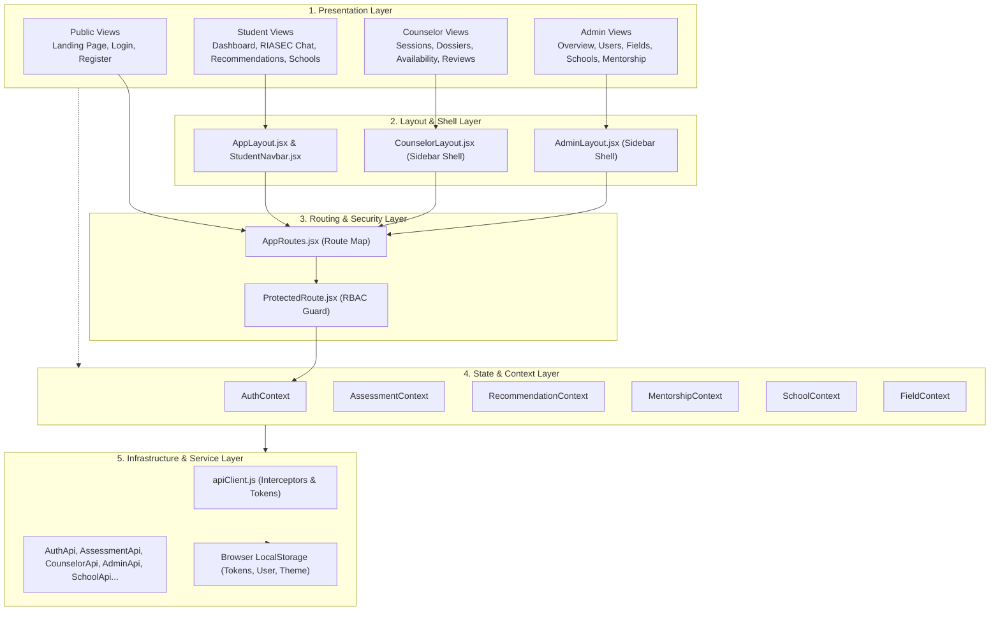
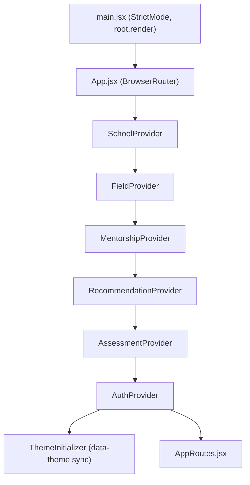
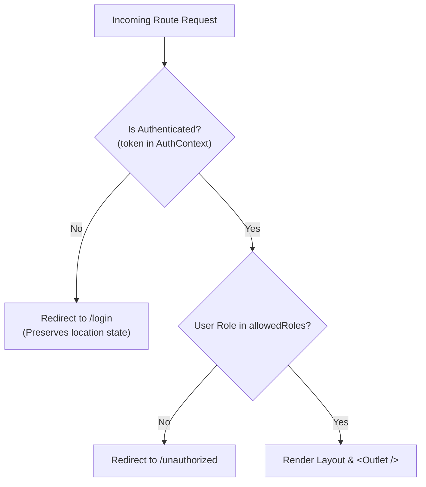
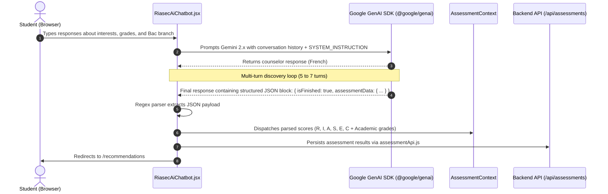
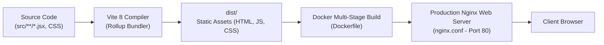

# Architecture Documentation — OrientCompanion Frontend

This document details the architectural design, structural patterns, data flows, and security boundaries of the **OrientCompanion** frontend web application.

---

## 1. High-Level Architectural Paradigm

OrientCompanion is built as a **Single Page Application (SPA)** using **React 19** and bundled with **Vite 8**. The application follows a layered, component-driven architecture with centralized Context-based state management and a decoupled API client layer.



---

## 2. Layered System Architecture

The application is structured into five distinct operational layers:



---

## 3. Component Hierarchy & Provider Nesting

All global providers are mounted in `src/App.jsx` in a strict dependency sequence:



### Provider Responsibilities

| Context Provider | Responsibility | Source File |
| :--- | :--- | :--- |
| **`AuthProvider`** | Manages JWT token lifecycle, user metadata, role resolution, and login/logout handlers. | `src/context/AuthContext.jsx` |
| **`AssessmentProvider`** | Stores current RIASEC evaluation results, student answers, and test completion state. | `src/context/AssessmentContext.jsx` |
| **`RecommendationProvider`**| Manages matching scores, filtered career suggestions, and priority school lists. | `src/context/RecommendationContext.jsx` |
| **`MentorshipProvider`** | Handles mentor listings, slot availability, session bookings, and history. | `src/context/MentorshipContext.jsx` |
| **`SchoolProvider`** | Provides catalog of Moroccan higher education institutions, thresholds, and entrance criteria. | `src/context/SchoolContext.jsx` |
| **`FieldProvider`** | Provides academic fields, specialties (*filières*), and degree tracks. | `src/context/FieldContext.jsx` |

---

## 4. Routing & Role-Based Access Control (RBAC)

The routing architecture in `src/routes/AppRoutes.jsx` enforces role-based navigation guards using `src/routes/ProtectedRoute.jsx`.



### Route Segmentation Matrix

| Path Scope | Allowed Roles | Layout Shell | Key Components |
| :--- | :--- | :--- | :--- |
| `/` | *Public* | None | `OrientLandingPage.jsx` |
| `/login`, `/register` | *Public* | None | `Login.jsx`, `RegisterPage.jsx` |
| `/dashboard`, `/assessment`, `/recommendations`, `/mentorship`, `/StudentRecommendedSchools`, `/board` | `STUDENT`, `ADMIN` | `AppLayout.jsx` & `StudentNavbar.jsx` | `Board.jsx`, `RiasecAiChatbot.jsx`, `RecommendationsPage.jsx` |
| `/counselor/*` | `COUNSELOR`, `ADMIN` | `CounselorLayout.jsx` | `CounselorDashboard.jsx`, `CounselorSessions.jsx` |
| `/admin/*` | `ADMIN` | `AdminLayout.jsx` | `AdminOverview.jsx`, `AdminUsers.jsx`, `AdminSchools.jsx` |

---

## 5. Service & Communication Architecture

### Centralized Axios Client (`src/api/apiClient.js`)

All communications with the backend REST server go through a centralized Axios instance:

1. **Base URL Resolution**: Configured via `import.meta.env.VITE_API_BASE_URL` with a fallback to `http://localhost:8080/api`.
2. **Request Interceptor**: Automatically inspects `localStorage` for `token` and injects the header:
   ```http
   Authorization: Bearer <jwt-token>
   ```
3. **Response Interceptor (Session Expiry Guard)**:
   - Catches `401 Unauthorized` responses.
   - Purges `token` and `user` from `localStorage`.
   - Forces a clean client-side redirect to `/login?expired=true`.

### Domain API Modules

```
src/api/
├── apiClient.js          # Shared Axios instance with interceptors
├── AuthApi.js            # POST /auth/login, POST /auth/register
├── assessmentApi.js      # GET /assessments, POST /assessments/submit
├── recommendationApi.js  # GET /recommendations, POST /recommendations/calculate
├── mentorshipApi.js      # GET /mentors, POST /sessions/book
├── schoolApi.js          # GET /schools, POST/PUT/DELETE /admin/schools
├── fieldApi.js           # GET /fields, POST/PUT/DELETE /admin/fields
├── CounselorApi.js       # GET /counselor/sessions, PUT /counselor/availability
└── AdminApi.js           # GET /admin/stats, GET /admin/users
```

---

## 6. AI Integration Architecture (RIASEC Chatbot)

The RIASEC assessment engine (`src/chat/RiasecAiChatbot.jsx`) operates as an AI conversational agent:



---

## 7. Theming Architecture

The application implements a zero-flicker dual theme engine (*Light* and *Dark* modes):

1. **CSS Variable Strategy** (`src/index.css`): Color tokens (`--canvas-bg`, `--text-primary`, `--accent-blue`, `--dash-card-bg`, etc.) are declared on `:root, [data-theme="light"]` and overridden under `[data-theme="dark"]`.
2. **DOM Attribution**: Theme is applied via `<html data-theme="...">` or `<div data-theme="...">`.
3. **Persistence & Synchronization**:
   - Persisted in `localStorage` under key `orient_theme`.
   - Synchronized across parallel components via the custom browser event:
     ```js
     window.dispatchEvent(new CustomEvent("orient_theme_change", { detail: nextTheme }));
     ```
   - Initialized before paint by `ThemeInitializer` in `src/App.jsx`.

---

## 8. Build & Deployment Architecture



- **Build Tool**: Vite 8 with `@vitejs/plugin-react`.
- **Production Asset Output**: Minified bundles in `/dist`.
- **Server Deployment**:
  - `Dockerfile`: Multi-stage build (Node alpine for build -> Nginx alpine for serving).
  - `nginx.conf`: Configured with `try_files $uri $uri/ /index.html` to support client-side HTML5 history routing.
  - `docker-compose.yml`: Container orchestration for web container deployment.
